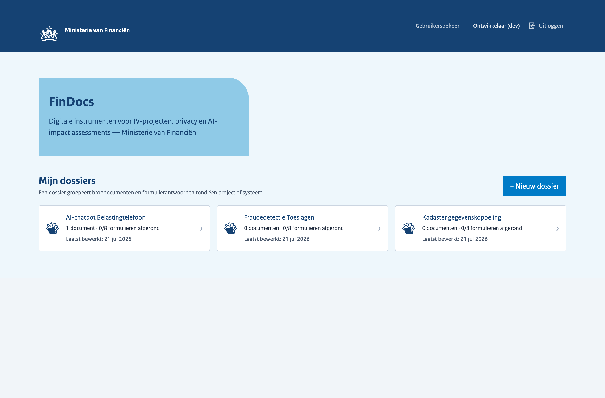
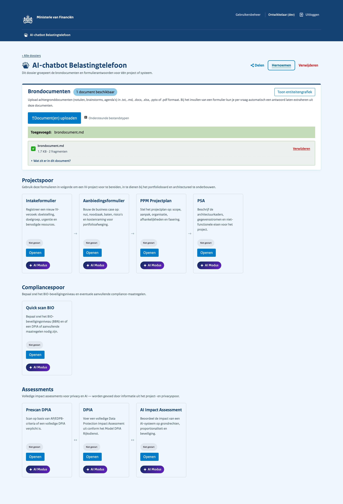
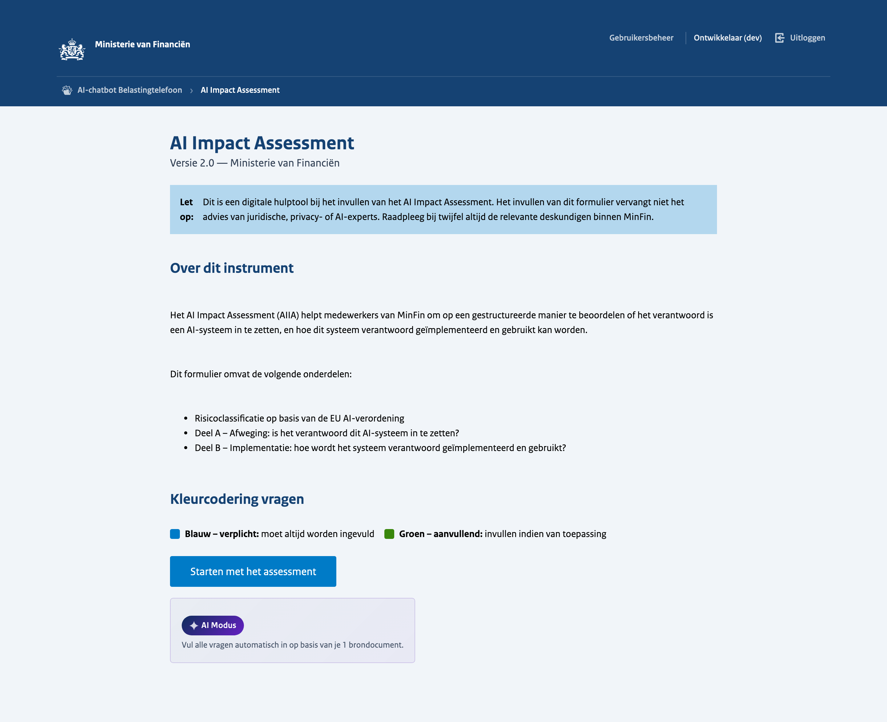
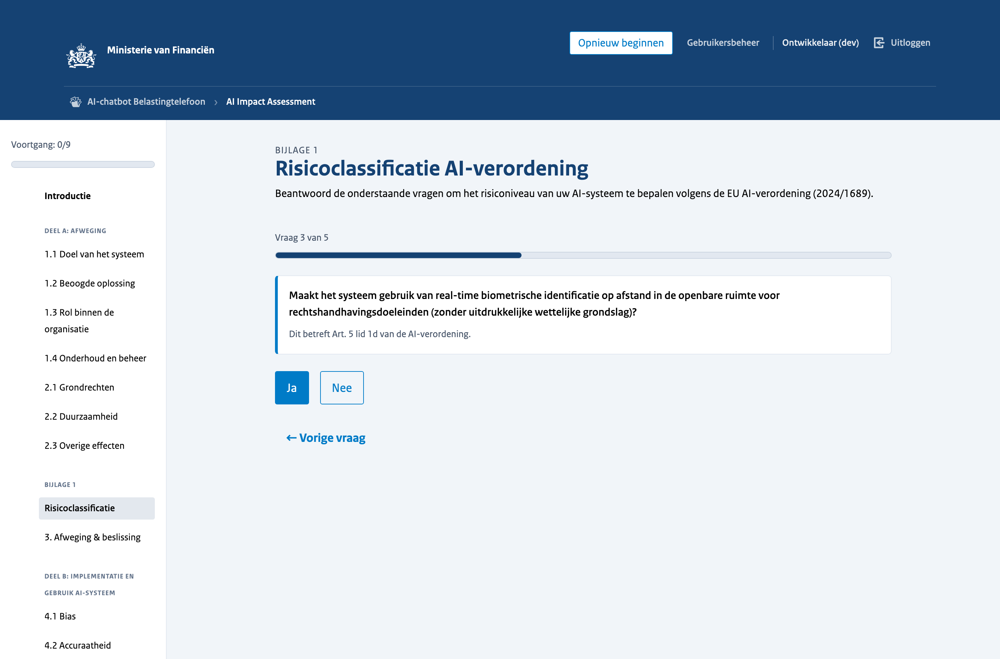
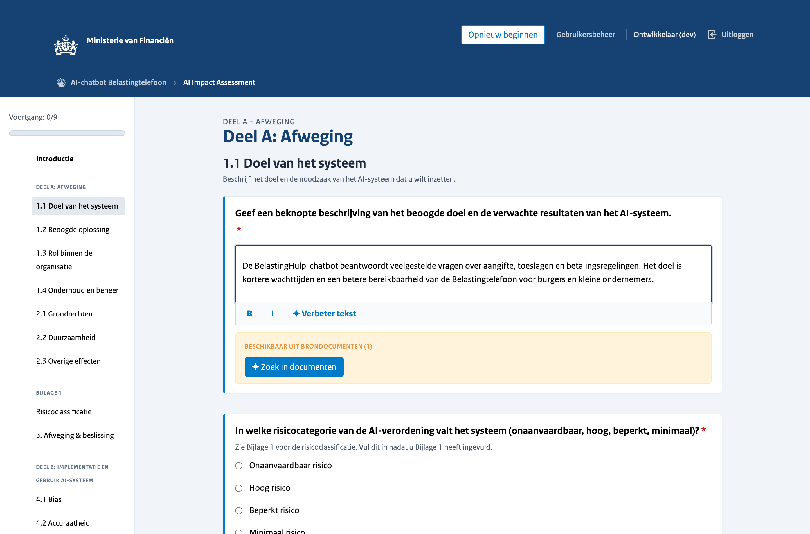
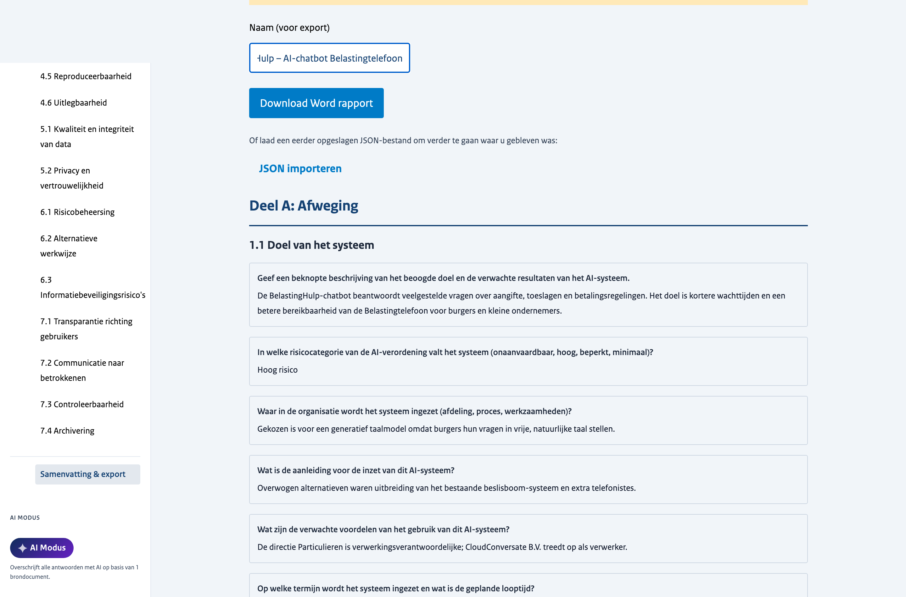

# findocs – AI-assisted Government Compliance Forms

> ⚠️ **Proof of Concept** — This project is an early-stage proof of concept and is not production-ready. We are very much looking for direction, feedback, and collaboration on where to take it next. Please reach out or open an issue if you have ideas.

A web application that helps Dutch government employees fill in AI-related compliance assessments. It guides users through structured forms and uses an LLM (a locally running Ollama model or Azure OpenAI) to extract answers from uploaded source documents, improve free-text, and synthesize answers across forms.



## Features

- **8 forms across three tracks** — Project (Intakeformulier, Aanbiedingsformulier, PPM Projectplan, PSA), Assessment (Prescan DPIA, DPIA, AI Impact Assessment), and Compliance (Quick scan BIO). Forms are defined as JSON files under `public/forms/` and loaded at runtime.
- **Login via Keycloak (SSO)** — The backend acts as an OpenID Connect backend-for-frontend: users log in through Keycloak, and a signed session cookie gates every API call. A `--dev` flag (backend) and `VITE_AUTH_BYPASS` (frontend) bypass the login for local development.
- **User management** — Beheerders (admins) can create, edit, reset passwords for, and delete users straight from the app via the Keycloak Admin API.
- **Dossier management** — Group source documents and form answers into named dossiers; switch between dossiers to work on separate projects simultaneously. Dossiers are stored server-side (with a debounced localStorage cache), so work survives across devices and sessions.
- **Dossier sharing** — Share a dossier with colleagues and assign a role: **viewer** (read-only), **editor** (fill in answers), or **owner**. Access to every session, document, and image endpoint is gated by the caller's grant.
- **Source document upload** — Upload background documents (`.txt`, `.md`, `.docx`, `.xlsx`, `.pptx`, `.pdf`) so the AI can extract relevant answers per question.
- **Retrieval-augmented answers (RAG)** — Uploaded documents are chunked and indexed in a LanceDB vector store; question answering retrieves the most relevant chunks and grounds suggestions in them, with citations back to the source.
- **Document ontology & entity graph** — Extracted entities and their relationships are visualised as an interactive graph, giving an overview of what a dossier's documents contain.
- **AI Mode** — One-click automation that fills in an entire form automatically, question by question, drawing on the uploaded source documents.
- **AI text improvement** — A "Verbeter tekst" button on every text field streams an improved version, preserving formatting, with a brief rationale.
- **Rich text editor** — Tiptap-powered editor for every free-text answer, supporting formatting, lists, and Mermaid diagrams.
- **Image attachments** — Attach PNG/JPEG images to individual questions; they are stored server-side and included in the export.
- **Table questions** — Structured, multi-row/-column table answers with add/delete row support and per-cell grounding.
- **EU AI Act risk classification** — Built-in guided questionnaire (Ja/Nee) that determines the risk category of an AI system under Regulation 2024/1689 before the main AIIA questions.
- **Forbidden AI system guard** — If the risk classification yields "onaanvaardbaar risico" (prohibited under Art. 5 EU AI Act), the form blocks further completion and shows a clear error.
- **Cross-form mapping** — Relevant AIIA answers are used to pre-suggest answers for related DPIA questions, eliminating duplicate work across assessments.
- **Decision gates** — Certain forms (e.g. Prescan DPIA) route users to the full DPIA only when the screening outcome requires it.
- **Section navigation & progress tracking** — A persistent sidebar shows the full form structure, a progress indicator, and lets you jump to any section; per-form completion percentage is shown in the header and sidebar.
- **Required vs. supplementary fields** — Questions are colour-coded: blue = required, green = supplementary.
- **Word and JSON export** — Download a completed form as a styled Word report (with a legacy "original template" export for the Intakeformulier), or import a previously saved JSON file to continue where you left off.
- **Streaming LLM inference** — AI features stream their output over Server-Sent Events for immediate feedback.
- **Pluggable LLM backend** — Runs against a locally hosted Ollama instance by default (no data leaves the machine); automatically switches to Azure OpenAI when `AZURE_OPENAI_ENDPOINT` is configured.

### Screenshots

**Portal — dossier, source documents, and form overview**


**Form introduction page with AI Mode**


**EU AI Act risk classification questionnaire**


**Form questions with sidebar navigation and AI text improvement**


**Summary and export**


## Gerelateerde tools

Het Ministerie van Binnenlandse Zaken en Koninkrijksrelaties (MinBZK) heeft een vergelijkbare tool ontwikkeld: [par-dpia-form](https://github.com/MinBZK/par-dpia-form). Beide tools richten zich op het digitaal invullen van DPIA-formulieren, maar ze zijn gebouwd voor andere contexten en hebben een ander uitgangspunt.

| | **par-dpia-form** (MinBZK) | **findocs** (MinFin) |
|---|---|---|
| Formulieren | DPIA, Pre-scan DPIA | AIIA, DPIA, Pre-scan DPIA, en meer |
| Installatie | Geen — standalone HTML-bestand | Node.js + Python + Ollama/Azure OpenAI + Keycloak vereist |
| Hosting | Draait puur in de browser (GitHub Pages) | Vereist een lokale of gehoste server |
| AI-ondersteuning | Geen | Tekstverbetering, extractie uit documenten (RAG) en kruisformulier-synthese via LLM |
| Opslaan | Handmatig als JSON-bestand exporteren/importeren | Server-side dossiers met authenticatie en delen |
| Kruisformulier-koppeling | Niet aanwezig | AIIA-antwoorden pre-suggereren DPIA-antwoorden |
| Rijke tekstbewerking | Nee | Ja, via Tiptap |
| Formulierdefinities | YAML-bestanden | JSON-bestanden |

**par-dpia-form** is ideaal als je een DPIA wil invullen zonder enige installatie of infrastructuur: open de HTML-pagina, vul in, exporteer naar PDF. **findocs** is geschikter wanneer je meerdere compliance-instrumenten in samenhang wil doorlopen (bijv. eerst een AIIA, daarna een DPIA waarbij relevante antwoorden al worden overgenomen), documenten wil hergebruiken en daarbij AI-hulp wil inzetten voor het formuleren van antwoorden.

### Beslishulpen: een aanvullende categorie

Naast invultools bestaan er ook **beslishulpen** (kwalificatietools). Deze vullen geen assessment in, maar helpen je via een vragenboom bepalen *welke* regelgeving en verplichtingen op jouw AI-systeem van toepassing zijn — bijvoorbeeld of het onder de AI-verordening valt, wat je rol is (aanbieder, gebruiksverantwoordelijke, importeur, distributeur) en in welke risicocategorie het systeem valt. Ze zijn complementair aan findocs: een beslishulp bepaalt de *scope* (welke instrumenten je moet doorlopen), findocs helpt vervolgens bij het daadwerkelijk *invullen* ervan.

Twee relevante voorbeelden:

- [**AI-Verordening Beslishulp**](https://github.com/MinBZK/ai-verordening-beslishulp) (MinBZK) — bepaalt of en hoe de EU AI-verordening van toepassing is op een AI-systeem.
- [**AI & Algoritmes Kwalificatie Tool (AI AQT)**](https://algorithmaudit.eu/nl/technical-tools/implementation-tool/) (Algorithm Audit) — classificeert algoritmische systemen tegen AI-verordening, AVG en kaders voor algoritmegovernance, inclusief identificatie, rol/status, risicocategorie en bijbehorende verplichtingen.

| | **AI-Verordening Beslishulp** (MinBZK) | **AI AQT** (Algorithm Audit) | **findocs** (MinFin) |
|---|---|---|---|
| Type | Beslishulp / kwalificatie | Beslishulp / kwalificatie | Invultool voor assessments |
| Doel | Bepalen of de AI-verordening van toepassing is | Identificeren en risico-classificeren van algoritmes (AI-verordening, AVG) | Invullen van AIIA, DPIA en meer |
| Werkwijze | Vragenboom (decision tree) | Dynamische vragenlijsten + venndiagram-output | Gestructureerde formulieren met AI-suggesties |
| Uitkomst | Risicoclassificatie + verplichtingenoverzicht | Classificatie + verplichtingen per rol/status/risico | Ingevuld assessment (Word-export) |
| AI-ondersteuning | Geen (regelgebaseerd) | Geen (regelgebaseerd) | LLM voor extractie, tekstverbetering en synthese |
| Installatie | Geen — embeddable of gehoste webpagina; lokaal via `npm run dev`/Docker | Geen — gehoste webpagina (open source) | Node.js + Python + Ollama/Azure OpenAI + Keycloak vereist |
| Opslag | Sessie-gebaseerd, optionele PDF-export | Centrale opslag mogelijk voor expert-review | Server-side dossiers met authenticatie en delen |
| Licentie | EUPL-1.2 | EUPL-1.2 | EUPL-1.2 |

Een typische workflow zou zijn: gebruik eerst een **beslishulp** om vast te stellen welke assessments verplicht zijn, en gebruik daarna **findocs** (of par-dpia-form) om die assessments in te vullen.

## Architecture

| Layer | Technology |
|---|---|
| Frontend | Vue 3 + TypeScript + Vite |
| Rich text editor | Tiptap (with Mermaid diagrams) |
| State management | Pinia (with persistence) + server-side dossiers |
| Design system | NL RVO Component Library |
| Word export | docx |
| Graph visualisation | vis-network |
| Backend API | FastAPI (Python) |
| Authentication | Keycloak (OpenID Connect, BFF pattern) |
| Vector store / RAG | LanceDB |
| LLM inference | Ollama (local) or Azure OpenAI |

## Prerequisites

- [Node.js](https://nodejs.org/) 18+
- [Python](https://www.python.org/) 3.13+
- [uv](https://docs.astral.sh/uv/) (Python package manager)
- [Ollama](https://ollama.com/) running locally with a model pulled (default: `llama3.2`), **or** an Azure OpenAI resource
- [Keycloak](https://www.keycloak.org/) for the login flow — or use the `--dev` bypass for local development

## Getting started

The quickest way to run everything locally is `python main.py --dev`, which bypasses the Keycloak login. Combine it with `VITE_AUTH_BYPASS=true` (already set in `.env.development`) on the frontend.

### 1. Pull the LLM model

```bash
ollama pull llama3.2
```

(Skip this if you are using Azure OpenAI — see the environment variables below.)

### 2. Install frontend dependencies

```bash
npm install
```

### 3. Install backend dependencies

```bash
uv sync
```

### 4. Configure environment (optional)

Copy `.env.example` to `.env` to override defaults:

```bash
cp .env.example .env
```

Available variables:

| Variable | Default | Description |
|---|---|---|
| `OLLAMA_MODEL` | `llama3.2` | Ollama model to use (when Azure is not configured) |
| `OLLAMA_BASE_URL` | `http://localhost:11434` | Ollama server URL |
| `OLLAMA_EMBEDDING_MODEL` | `nomic-embed-text` | Ollama embedding model for RAG |
| `AZURE_OPENAI_ENDPOINT` | _(unset)_ | When set, Azure OpenAI is used instead of Ollama |
| `AZURE_OPENAI_API_KEY` | _(unset)_ | Azure OpenAI API key |
| `AZURE_OPENAI_DEPLOYMENT` | `gpt-5.3-chat` | Azure chat deployment name |
| `AZURE_OPENAI_API_VERSION` | `2025-04-01-preview` | Azure API version |
| `AZURE_OPENAI_EMBEDDING_DEPLOYMENT` | _(unset)_ | Azure embedding deployment for RAG (may live on a separate resource) |
| `CORS_ORIGINS` | `http://localhost:5173` | Allowed CORS origins |
| `OIDC_DISCOVERY_URL` | _(see `.env.example`)_ | Keycloak OpenID Connect discovery URL |
| `OIDC_CLIENT_ID` / `OIDC_CLIENT_SECRET` | `findocs-bff` / `dev-secret-change-me` | BFF client credentials |
| `OIDC_ADMIN_CLIENT_ID` / `OIDC_ADMIN_CLIENT_SECRET` | `findocs-admin` / … | Service-account client for user management (Keycloak Admin API) |
| `OIDC_REDIRECT_URI` | `http://localhost:8080/api/auth/callback` | OIDC redirect URI |
| `SESSION_SECRET` | `change-me-…` | Secret used to sign the session cookie (`openssl rand -hex 32`) |
| `SESSION_HTTPS_ONLY` | `false` | Set to `true` in production |
| `LANCEDB_PATH` | `./data/lancedb` | LanceDB vector-store path |
| `DOCS_PATH` / `IMAGES_PATH` / `DOSSIERS_PATH` | `./data/...` | Persistent stores for documents, images, and dossiers |

See `.env.example` and `.env.azure.example` for the full set and inline notes.

### 5. Start the backend

For local development with the login bypassed:

```bash
uv run python main.py --dev
```

Or run uvicorn directly (requires a reachable Keycloak):

```bash
uv run uvicorn main:app --reload
```

The API will be available at `http://localhost:8000`.

### 6. Start the frontend

```bash
npm run dev
```

The app will be available at `http://localhost:5173` (auth bypassed via `.env.development`).

## Running with Docker

```bash
docker compose up
```

This starts Ollama, the backend (FastAPI, port 8000), and the frontend (nginx, published on port **8080**) in containers, with a persistent volume for the LanceDB/document/image/dossier stores. Keycloak runs in a separate stack and is reached over an external `keycloak-shared` network — start that stack first. Set `OIDC_*`, `SESSION_SECRET`, and (optionally) the Azure OpenAI variables in your environment before bringing the stack up.

## API

All endpoints live under `/api` and require an authenticated session (except the auth routes themselves). Endpoints that touch a dossier's data verify the caller's grant (viewer/editor/owner).

### AI

| Endpoint | Method | Description |
|---|---|---|
| `/api/improve` · `/api/improve/stream` | `POST` | Suggest an improved version of a text fragment |
| `/api/synthesize` · `/api/synthesize/stream` | `POST` | Synthesize a DPIA answer from AIIA answers |
| `/api/smooth/stream` | `POST` | Smooth/finalise a drafted answer |
| `/api/extract` · `/api/extract/stream` | `POST` | Extract an answer for a question |
| `/api/extract/rag/stream` | `POST` | Extract an answer grounded in retrieved document chunks (RAG) |

### Documents & images

| Endpoint | Method | Description |
|---|---|---|
| `/api/documents/index` | `POST` | Upload and index a source document |
| `/api/documents` | `GET` | List a dossier's indexed documents |
| `/api/documents/{doc_id}` | `DELETE` | Remove an indexed document |
| `/api/documents/verify` | `POST` | Verify document availability |
| `/api/images` | `POST` | Attach an image to a question |
| `/api/images/{image_id}` | `GET` · `DELETE` | Fetch or delete a question image |
| `/api/sessions/{session_id}` | `DELETE` | Delete a session's data |

### Dossiers, users & auth

| Endpoint | Method | Description |
|---|---|---|
| `/api/dossiers` · `/api/dossiers/{id}` | `GET` · `PUT` · `DELETE` | Manage dossiers |
| `/api/dossiers/{id}/grants/{sub}` | `PUT` · `DELETE` | Share/unshare a dossier with a user (assign a role) |
| `/api/users/search` | `GET` | Search users to share with |
| `/api/admin/users` | `GET` · `POST` · `PUT` · `DELETE` | User management (beheerder only) |
| `/api/admin/users/{id}/reset-password` | `POST` | Reset a user's password |
| `/api/auth/login` · `/callback` · `/me` · `/logout` | `GET` | Keycloak OIDC BFF flow |

## Source documents

| Document | Source |
|---|---|
| AI Impact Assessment (IenW, v2.0) | [rijksoverheid.nl](https://www.rijksoverheid.nl/documenten/rapporten/2022/11/30/ai-impact-assessment-ministerie-van-infrastructuur-en-waterstaat) |
| Model DPIA Rijksdienst (v3.0) | [kcbr.nl](https://www.kcbr.nl/sites/default/files/2023-09/Model%20DPIA%20Rijksdienst%20v3.0.pdf) |

## Mogelijke toekomstige functionaliteit

### Samenwerken via Tiptap

De rich-text editor (Tiptap) biedt een solide basis voor real-time samenwerking. Met de Tiptap Collaboration-extensie (gebaseerd op Yjs/CRDT) kunnen meerdere gebruikers tegelijk aan hetzelfde formulier werken: wijzigingen worden direct zichtbaar, conflicten worden automatisch opgelost en er is geen handmatig samenvoegen nodig. Dit is met name waardevol voor grote assessments waarbij juridische, privacy- en technische experts elk hun eigen secties invullen. Dossiers kunnen nu al gedeeld worden met rollen (viewer/editor/owner); gelijktijdige live-bewerking is de logische volgende stap.

## License

Licensed under the [European Union Public Licence v1.2 (EUPL-1.2)](LICENSE).
