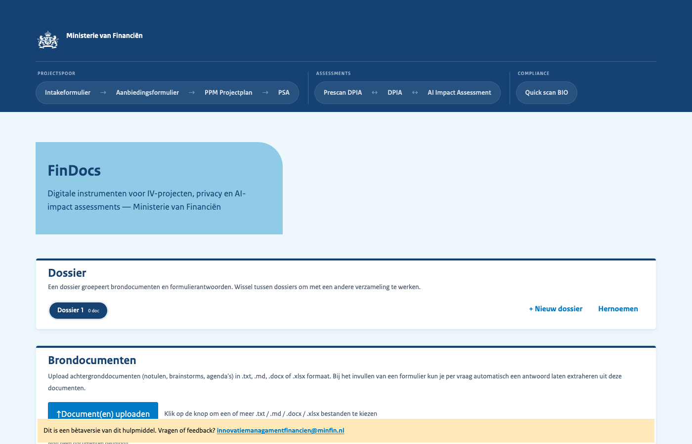
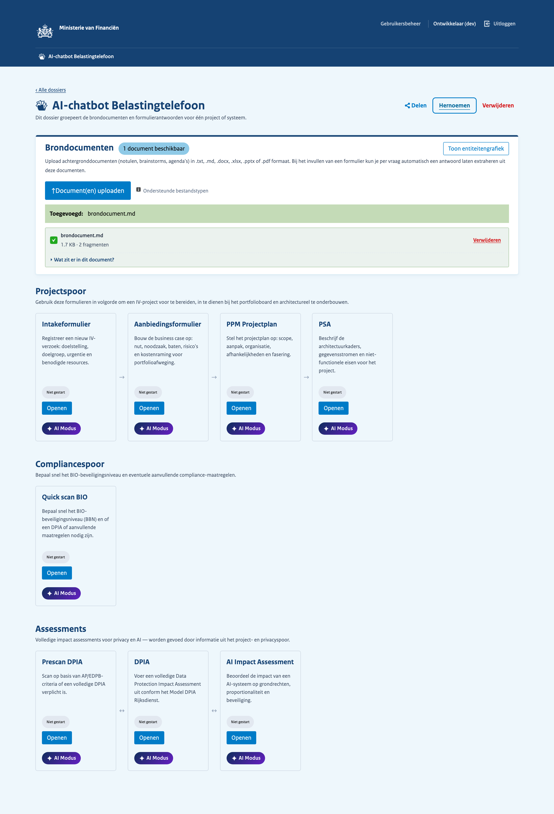
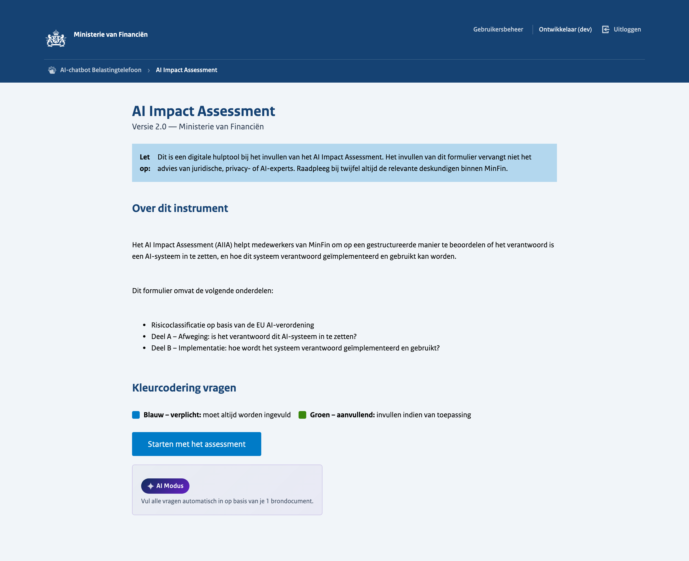
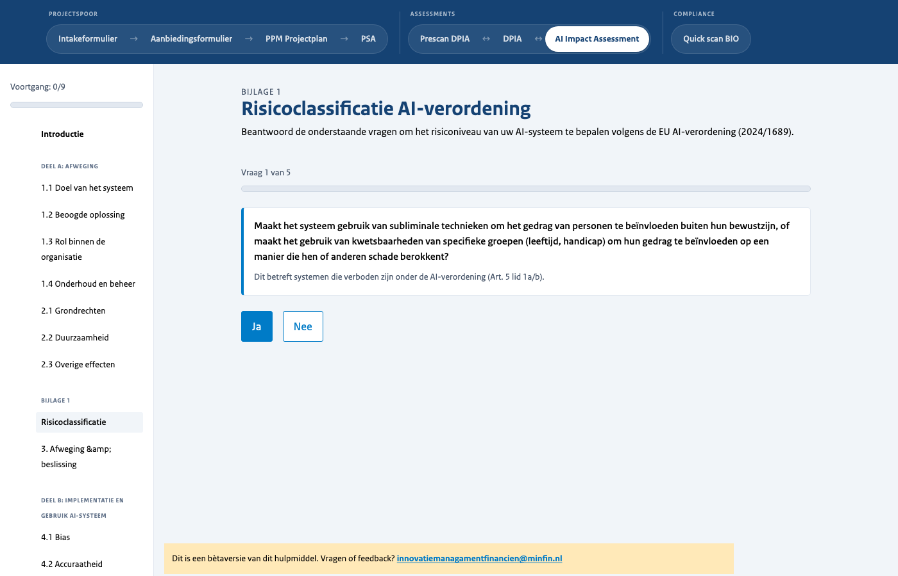
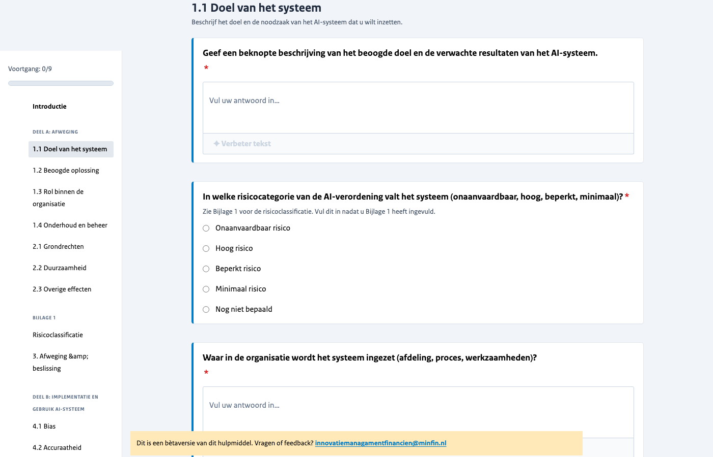
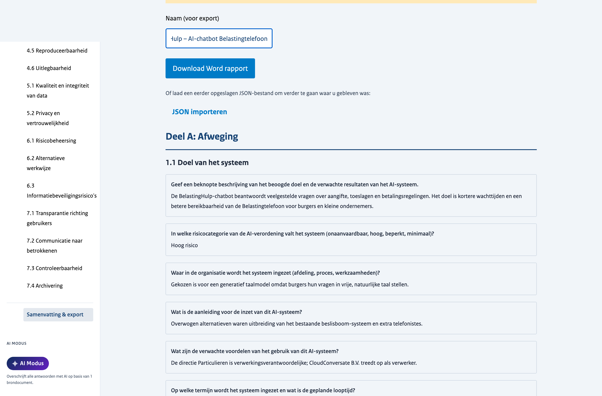

# findocs – AI-assisted Government Compliance Forms

> ⚠️ **Proof of Concept** — This project is an early-stage proof of concept and is not production-ready. We are very much looking for direction, feedback, and collaboration on where to take it next. Please reach out or open an issue if you have ideas.

A web application that helps Dutch government employees fill in AI-related compliance assessments. It guides users through structured forms and uses an LLM (a locally running Ollama model or Azure OpenAI) to extract answers from uploaded source documents, improve free-text, and synthesize answers across forms.



## Features

- **20 forms grouped by lifecycle phase** — *Verkennen & afbakenen* (Intakeformulier, Quickscan BIO2, Prescan DPIA) → *Onderbouwen & besluiten* (Aanbiedingsformulier, Restrisico-acceptatie) → *Ontwerpen* (PPM Projectplan, PSA, Datakwaliteit-assessment, Dataset-registratie) → *Toetsen* (DPIA, AI Impact Assessment, IAMA, EU AI Act Compliance Checklist, Data-ethiektoets, IHH-toets, Cloudtoets) → *In gebruik nemen* (AI-systeemregistratie/Model Card, Algoritmeregister-publicatie, Verwerkingsregister, Toegankelijkheidsverklaring) → *Beheren & evalueren* (nothing yet — deliberately shown empty). Every form describes one project or system, matching the dossier that holds it. The subject domain (privacy, beveiliging, AI, data, project) is a tag on each card, not a grouping — see [`docs/sporen-en-roadmap.md`](docs/sporen-en-roadmap.md) for the reasoning and the roadmap of missing instruments. Forms are defined as JSON files under `public/forms/` and loaded at runtime. Every form records where it comes from and how faithfully — see [Form lineage](#form-lineage) — and carries a stable identifier in the shape the MinBZK task-registry uses for its instruments (`urn:nl:minfin:tr:dpia:3.0`), see [Form URNs](#form-urns).
- **Beslishulp AI-verordening (MinBZK)** — The official [ai-verordening-beslishulp](https://github.com/MinBZK/ai-verordening-beslishulp) decision tree runs inside the app as a modal, launched from a tile fused to the EU AI Act card on the dossier page. It determines whether the AI-verordening applies, which role you hold (aanbieder, gebruiksverantwoordelijke, importeur, distributeur) and which risk group the system falls in, with the upstream explanations, sources and obligations intact. The outcome is stored on the dossier and supplies the risk classification (Bijlage 1) of the AI Impact Assessment. The decision tree is vendored (`vendor/ai-verordening-beslishulp/`, EUPL-1.2) and built into a runtime asset with `npm run beslishulp:build`.
- **Login via Keycloak (SSO)** — The backend acts as an OpenID Connect backend-for-frontend: users log in through Keycloak, and a signed session cookie gates every API call. A `--dev` flag (backend) and `VITE_AUTH_BYPASS` (frontend) bypass the login for local development.
- **User management** — Beheerders (admins) can create, edit, reset passwords for, and delete users straight from the app via the Keycloak Admin API.
- **Dossier management** — Group source documents and form answers into named dossiers; switch between dossiers to work on separate projects simultaneously. Dossiers are stored server-side (with a debounced localStorage cache), so work survives across devices and sessions.
- **Dossier sharing** — Share a dossier with colleagues and assign a role: **viewer** (read-only), **editor** (fill in answers), or **owner**. Access to every session, document, and image endpoint is gated by the caller's grant.
- **Real-time collaboration** — Multiple users can edit the same dossier simultaneously. Answers sync live over a WebSocket using Yjs/CRDT (Tiptap Collaboration on the frontend, pycrdt on the backend), with collaborative carets in the editor and a presence bar showing who else is working in the dossier. Live editing requires the editor or owner role; conflicts merge automatically.
- **Source document upload** — Upload background documents (`.txt`, `.md`, `.docx`, `.xlsx`, `.pptx`, `.pdf`) so the AI can extract relevant answers per question.
- **Retrieval-augmented answers (RAG)** — Uploaded documents are chunked and indexed in a LanceDB vector store; question answering retrieves the most relevant chunks and grounds suggestions in them, with citations back to the source.
- **Document ontology & entity graph** — Extracted entities and their relationships are visualised as an interactive graph, giving an overview of what a dossier's documents contain.
- **AI Mode** — One-click automation that fills in an entire form automatically, question by question, drawing on the uploaded source documents.
- **AI text improvement** — A "Verbeter tekst" button on every text field streams an improved version, preserving formatting, with a brief rationale.
- **Rich text editor** — Tiptap-powered editor for every free-text answer, supporting formatting, lists, and Mermaid diagrams.
- **Image attachments** — Attach PNG/JPEG images to individual questions; they are stored server-side and included in the export.
- **Table questions** — Structured, multi-row/-column table answers with add/delete row support and per-cell grounding.
- **EU AI Act risk classification** — Built-in guided questionnaire (Ja/Nee) that determines the risk category of an AI system under Regulation 2024/1689 before the main AIIA questions.
- **Forbidden AI system guard** — If the risk classification yields "onaanvaardbaar risico" (prohibited under Art. 5 EU AI Act), the form blocks further completion and shows a clear error.
- **Cross-form mapping** — Relevant AIIA answers are used to pre-suggest answers for related DPIA questions, eliminating duplicate work across assessments.
- **Decision gates** — Certain forms (e.g. Prescan DPIA) route users to the full DPIA only when the screening outcome requires it.
- **Section navigation & progress tracking** — A persistent sidebar shows the full form structure, a progress indicator, and lets you jump to any section; per-form completion percentage is shown in the header and sidebar.
- **Required vs. supplementary fields** — Questions are colour-coded: blue = required, green = supplementary.
- **Word and JSON export** — Download a completed form as a styled Word report (with an "original template" export for the Intakeformulier and the PPM Projectplan 2.0), or import a previously saved JSON file to continue where you left off. Every export names the form definition it came from by URN, so a printed report stays traceable to the exact instrument and version.
- **Streaming LLM inference** — AI features stream their output over Server-Sent Events for immediate feedback.
- **Pluggable LLM backend** — Runs against a locally hosted Ollama instance by default (no data leaves the machine); automatically switches to Azure OpenAI when `AZURE_OPENAI_ENDPOINT` is configured.

### Screenshots

**Portal — dossier, source documents, and form overview**


**Form introduction page with AI Mode**


**EU AI Act risk classification questionnaire**


**Form questions with sidebar navigation and AI text improvement**


**Summary and export**


## Gerelateerde tools

Het Ministerie van Binnenlandse Zaken en Koninkrijksrelaties (MinBZK) heeft een vergelijkbare tool ontwikkeld: [par-dpia-form](https://github.com/MinBZK/par-dpia-form). Beide tools richten zich op het digitaal invullen van DPIA-formulieren, maar ze zijn gebouwd voor andere contexten en hebben een ander uitgangspunt.

| | **par-dpia-form** (MinBZK) | **findocs** (MinFin) |
|---|---|---|
| Formulieren | DPIA, Pre-scan DPIA | AIIA, DPIA, Pre-scan DPIA, en meer |
| Installatie | Geen — standalone HTML-bestand | Node.js + Python + Ollama/Azure OpenAI + Keycloak vereist |
| Hosting | Draait puur in de browser (GitHub Pages) | Vereist een lokale of gehoste server |
| AI-ondersteuning | Geen | Tekstverbetering, extractie uit documenten (RAG) en kruisformulier-synthese via LLM |
| Opslaan | Handmatig als JSON-bestand exporteren/importeren | Server-side dossiers met authenticatie en delen |
| Kruisformulier-koppeling | Niet aanwezig | AIIA-antwoorden pre-suggereren DPIA-antwoorden |
| Rijke tekstbewerking | Nee | Ja, via Tiptap |
| Formulierdefinities | YAML-bestanden | JSON-bestanden |

**par-dpia-form** is ideaal als je een DPIA wil invullen zonder enige installatie of infrastructuur: open de HTML-pagina, vul in, exporteer naar PDF. **findocs** is geschikter wanneer je meerdere compliance-instrumenten in samenhang wil doorlopen (bijv. eerst een AIIA, daarna een DPIA waarbij relevante antwoorden al worden overgenomen), documenten wil hergebruiken en daarbij AI-hulp wil inzetten voor het formuleren van antwoorden.

### Beslishulpen: een aanvullende categorie

Naast invultools bestaan er ook **beslishulpen** (kwalificatietools). Deze vullen geen assessment in, maar helpen je via een vragenboom bepalen *welke* regelgeving en verplichtingen op jouw AI-systeem van toepassing zijn — bijvoorbeeld of het onder de AI-verordening valt, wat je rol is (aanbieder, gebruiksverantwoordelijke, importeur, distributeur) en in welke risicocategorie het systeem valt. Ze zijn complementair aan findocs: een beslishulp bepaalt de *scope* (welke instrumenten je moet doorlopen), findocs helpt vervolgens bij het daadwerkelijk *invullen* ervan.

Twee relevante voorbeelden:

- [**AI-Verordening Beslishulp**](https://github.com/MinBZK/ai-verordening-beslishulp) (MinBZK) — bepaalt of en hoe de EU AI-verordening van toepassing is op een AI-systeem.
- [**AI & Algoritmes Kwalificatie Tool (AI AQT)**](https://algorithmaudit.eu/nl/technical-tools/implementation-tool/) (Algorithm Audit) — classificeert algoritmische systemen tegen AI-verordening, AVG en kaders voor algoritmegovernance, inclusief identificatie, rol/status, risicocategorie en bijbehorende verplichtingen.

| | **AI-Verordening Beslishulp** (MinBZK) | **AI AQT** (Algorithm Audit) | **findocs** (MinFin) |
|---|---|---|---|
| Type | Beslishulp / kwalificatie | Beslishulp / kwalificatie | Invultool voor assessments |
| Doel | Bepalen of de AI-verordening van toepassing is | Identificeren en risico-classificeren van algoritmes (AI-verordening, AVG) | Invullen van AIIA, DPIA en meer |
| Werkwijze | Vragenboom (decision tree) | Dynamische vragenlijsten + venndiagram-output | Gestructureerde formulieren met AI-suggesties |
| Uitkomst | Risicoclassificatie + verplichtingenoverzicht | Classificatie + verplichtingen per rol/status/risico | Ingevuld assessment (Word-export) |
| AI-ondersteuning | Geen (regelgebaseerd) | Geen (regelgebaseerd) | LLM voor extractie, tekstverbetering en synthese |
| Installatie | Geen — embeddable of gehoste webpagina; lokaal via `npm run dev`/Docker | Geen — gehoste webpagina (open source) | Node.js + Python + Ollama/Azure OpenAI + Keycloak vereist |
| Opslag | Sessie-gebaseerd, optionele PDF-export | Centrale opslag mogelijk voor expert-review | Server-side dossiers met authenticatie en delen |
| Licentie | EUPL-1.2 | EUPL-1.2 | EUPL-1.2 |

Een typische workflow zou zijn: gebruik eerst een **beslishulp** om vast te stellen welke assessments verplicht zijn, en gebruik daarna **findocs** (of par-dpia-form) om die assessments in te vullen.

Die eerste stap zit inmiddels in findocs zelf: de **AI-Verordening Beslishulp** van MinBZK is geïntegreerd als modal (zie [Features](#features)). De beslisboom wordt als gepinde kopie meegeleverd onder `vendor/ai-verordening-beslishulp/` en blijft daarmee herleidbaar tot de upstream bron; inhoudelijke vragen over de beslisboom horen bij MinBZK (ai-verordening@minbzk.nl), niet bij findocs.

## Form URNs

Every form carries a stable identifier in the shape the [MinBZK task-registry](https://github.com/MinBZK/task-registry) uses for its instruments:

```
urn:nl:<authority>:<registry>:<instrument>:<major>.<minor>
```

Upstream, `schemas/schema_instruments.json` pins instrument URNs to `^urn:nl:aivt:tr:[a-z]+:[0-9]+\.[0-9]+` — authority `aivt`, registry `tr` (e.g. `urn:nl:aivt:tr:iama:1.0`). This tool mints in the authority of the issuing organisation, `minfin`, keeping the registry segment `tr`, so the identifiers have the same shape and can sit side by side without writing into someone else's namespace:

```
urn:nl:minfin:tr:dpia:3.0
```

The instrument segment is the form id, the version segment the form's `version`. Announced forms that have no JSON yet (the placeholders in `index.json`) are pinned at `0.1`.

Two fields, deliberately distinct:

| Field | Names | Present on |
|---|---|---|
| `urn` | *our* form definition | every form, incl. placeholders |
| `registryUrn` | the upstream task-registry instrument the form implements | only forms with a real counterpart there |

The URN lives in both `public/forms/index.json` and the form JSON itself; `src/utils/formUrn.ts` owns the convention (`buildFormUrn`, `parseFormUrn`, `FORM_URN_PATTERN`) and `src/utils/formUrn.test.ts` fails the build if the two drift apart, a URN is missing, or a version segment no longer matches the form's `version`. It shows up on the form card and the form intro page, and travels along in the Word cover metadata, the Markdown header and the JSON export (`formUrn` / `formRegistryUrn`).

For the three **generated** forms (DPIA, Prescan DPIA, IAMA) the URN lives in `scripts/form-overlays/<name>.overlay.json` under `form`, so `npm run forms:build` keeps emitting it.

| Form | URN | Task-registry instrument |
|---|---|---|
| Intakeformulier | `urn:nl:minfin:tr:intake:2.0` | — |
| Projectaanbiedingsformulier | `urn:nl:minfin:tr:aanbiedingsformulier:2.0` | — |
| PPM Projectplan | `urn:nl:minfin:tr:ppm:2.0` | — |
| PSA | `urn:nl:minfin:tr:psa:1.0` | — |
| Quickscan BIO2 | `urn:nl:minfin:tr:quickscan:2.0` | — |
| Prescan DPIA | `urn:nl:minfin:tr:prescandpia:2.0` | — |
| DPIA | `urn:nl:minfin:tr:dpia:3.0` | — |
| AI Impact Assessment | `urn:nl:minfin:tr:aiia:2.1` | `urn:nl:aivt:tr:aiia:1.0` |
| IAMA | `urn:nl:minfin:tr:iama:2.0` | `urn:nl:aivt:tr:iama:1.0` |
| EU AI Act Compliance Checklist | `urn:nl:minfin:tr:euaiact:0.1` | `urn:nl:aivt:tr:ca:1.0` |
| Data-ethiektoets | `urn:nl:minfin:tr:dataethiek:1.0` | — |
| IHH-toets | `urn:nl:minfin:tr:ihhtoets:0.1` | — |
| Cloudtoets | `urn:nl:minfin:tr:cloudtoets:1.0` | — |
| BIA *(placeholder)* | `urn:nl:minfin:tr:bia:0.1` | — |
| Datakwaliteit-assessment | `urn:nl:minfin:tr:datakwaliteit:1.0` | — |
| Dataset-registratie (datasheet) | `urn:nl:minfin:tr:datasetregistratie:1.0` | — |
| AI-systeemregistratie (Model Card) | `urn:nl:minfin:tr:modelcard:0.1` | — |
| Algoritmeregister-publicatie | `urn:nl:minfin:tr:algoritmeregister:1.0` | — |
| Verwerkingsregister (AVG art. 30) | `urn:nl:minfin:tr:verwerkingsregister:1.0` | — |
| Toegankelijkheidsverklaring | `urn:nl:minfin:tr:toegankelijkheid:1.0` | — |
| Restrisico-acceptatie | `urn:nl:minfin:tr:restrisico:1.1` | — |
| Projectvoortgangsrapportage *(placeholder)* | `urn:nl:minfin:tr:voortgangsrapportage:0.1` | — |
| Projectafwijkingsformulier *(placeholder)* | `urn:nl:minfin:tr:afwijkingsformulier:0.1` | — |
| Evaluatieformulier *(placeholder)* | `urn:nl:minfin:tr:evaluatie:0.1` | — |
| Risico-impactformulier *(placeholder)* | `urn:nl:minfin:tr:risicoimpact:0.1` | — |

## Form lineage

Every form carries a `source` block in its JSON (typed as `FormSource` in `src/models/Assessment.ts`) recording the instrument it comes from, the publisher, the exact reference inside that source, and **how faithfully** it follows the original. Nothing at runtime depends on it — it exists so that any answer in this tool can be traced back to the instrument it belongs to, without reading git history.

The `derivation` field has four values:

| Value | Meaning |
|---|---|
| `generated` | Machine-converted from a vendored upstream definition. **Do not hand-edit the JSON** — edit the overlay and re-run `npm run forms:build`. |
| `harmonized` | Hand-built, but field-for-field aligned with a named external instrument; imported fields carry the upstream identifier as `officialId`. |
| `derived` | Modelled on a framework that ships no fill-in template. The concepts are the source's; the questions are ours. |
| `original` | Written for this tool or digitised from an internal MinFin template. No external original exists. |

| Form | Track | Original instrument | Publisher | Derivation |
|---|---|---|---|---|
| Intakeformulier | Verkennen | Intakeformulier IV-verzoek (intern sjabloon) | MinFin | `original` |
| Quickscan BIO2 | Verkennen | Classificatietoets BIO2 (`QIS BIO2 MinFin v1.0 - 10072026.xlsx`), op de [BIO2](https://bio-overheid.nl/)-handreiking dataclassificatie van de IBD | MinFin | `harmonized` |
| Prescan DPIA | Verkennen | Pre-scan DPIA v2.0 (`urn:nl:prescan`) | MinBZK | `generated` |
| Aanbiedingsformulier | Besluiten | PPM-aanbiedingsformulier (intern sjabloon) | MinFin | `original` |
| Restrisico-acceptatie | Besluiten | Geen extern origineel — sluitstuk van DPIA/AIIA/IAMA/BIO, naar het gangbare patroon van formele risicoacceptatie | MinFin | `original` |
| PPM Projectplan | Ontwerpen | PPM-Projectplan 2.0 | MinFin | `original` |
| PSA | Ontwerpen | Project Start Architectuur (intern sjabloon, NORA-lagen) | MinFin | `original` |
| Datakwaliteit-assessment | Ontwerpen | DAMA-DMBOK2 hfdst. 13 (Data Quality); ISO/IEC 25012, DAMA-NL DDQ | DAMA International | `derived` |
| Dataset-registratie | Ontwerpen | DAMA-DMBOK2 hfdst. 12 (Metadata Management); DCAT-AP-NL, MIM 1.2, "Datasheets for Datasets" | DAMA International | `derived` |
| DPIA | Toetsen | Model DPIA Rijksdienst v3.0 (`urn:nl:dpia`) | MinBZK | `generated` |
| AI Impact Assessment | Toetsen | [AI Impact Assessment v2.0](https://www.rijksoverheid.nl/documenten/rapporten/2022/11/30/ai-impact-assessment-ministerie-van-infrastructuur-en-waterstaat) | MinIenW | `harmonized` |
| IAMA | Toetsen | Impact Assessment Mensenrechten en Algoritmes v2 (`urn:nl:iama`) | MinBZK | `generated` |
| EU AI Act Compliance Checklist | Toetsen | AI-BOK v1.0 Template 3 + task-registry `conformity_assessment_eu_ai_act` (`urn:nl:aivt:tr:ca:1.0`) | Jan Willem van Veen / MinBZK | `harmonized` |
| Data-ethiektoets | Toetsen | DAMA-DMBOK2 hfdst. 2 (Data Handling Ethics), §3.1 — Belmont-principes | DAMA International | `derived` |
| Cloudtoets | Toetsen | Handreiking gebruik clouddienst v1.0 (`Handreiking Toestaan Cloudtoepassingv1.0.docx`); Cloudbeleid MinFin, Rijksbreed Cloudbeleid 2022, implementatiekader 'risicoafweging cloudgebruik' | MinFin (Adviescommissie Cloudgebruik) | `harmonized` |
| IHH-toets | Toetsen | Informatiehuishoudingstoets bij IV-verzoeken (intern sjabloon CDIO/IHH); Archiefwet, RINFIN 2022, NEN-ISO 16175-1:2020, DUTO-raamwerk Nationaal Archief | MinFin (CDIO/IHH) | `harmonized` |
| AI-systeemregistratie (Model Card) | In gebruik nemen | AI-BOK v1.0 Template 2 | Jan Willem van Veen | `harmonized` |
| Algoritmeregister-publicatie | In gebruik nemen | [Algoritmeregister](https://algoritmes.overheid.nl/) — standaard voor de publicatie van algoritmes | MinBZK | `harmonized` |
| Verwerkingsregister | In gebruik nemen | [AVG](https://eur-lex.europa.eu/legal-content/NL/TXT/?uri=CELEX%3A32016R0679) art. 30 lid 1 (beveiliging: art. 32 lid 1) | Europese Unie | `derived` |
| Toegankelijkheidsverklaring | In gebruik nemen | Tijdelijk besluit digitale toegankelijkheid overheid; modelverklaring [DigiToegankelijk](https://www.digitoegankelijk.nl/) (Uitvoeringsbesluit (EU) 2018/1523), EN 301 549 / WCAG 2.1 AA | Rijksoverheid / Logius | `harmonized` |

Two caveats the `source` blocks also record. The **Algoritmeregister** and **Toegankelijkheidsverklaring** forms *prepare* a publication — the official filing happens in the upstream register, and both upstream schemas evolve, so verify the current fields before publishing. And the three DAMA-derived forms take concepts, not text: DAMA-DMBOK2 is copyrighted and ships no fill-in template. The AI-BOK templates may be freely used and adapted with attribution (p. 204).

The forms parked as **organisation-level** (AI Governance Charter, AI Maturity Quick Scan, Shadow AI Inventory, Data Governance Charter, Data-management volwassenheidsscan) are deliberately absent: a dossier describes one project or system. See [`docs/sporen-en-roadmap.md`](docs/sporen-en-roadmap.md) §3; the three that were built remain in git history.

## AI Body of Knowledge forms & MinBZK harmonization

Two of the forms are derived from the **AI Body of Knowledge (AI-BOK v1.0)** by Jan Willem van Veen — a reference framework for AI governance, lifecycle management and organizational design, aligned with ISO 42001, the NIST AI RMF and the EU AI Act. Its appendix ships ready-to-use templates that map cleanly onto findocs' JSON form schema. Where an AI-BOK template overlaps with an authoritative Dutch government instrument, the form is **harmonized** with the corresponding MinBZK schema, and each imported field carries the upstream identifier (`officialId`) for traceability — the same approach already used for the DPIA, Pre-scan DPIA and IAMA.

| Form | Track | AI-BOK source | MinBZK harmonization |
|---|---|---|---|
| EU AI Act Compliance Checklist | Toetsen | Template 3 | EU-conformiteitsverklaring (bijlage V / art. 47) folded in as the capstone section from task-registry `conformity_assessment_eu_ai_act` (`urn:nl:aivt:tr:ca:1.0`); each declaration field carries its URN as `officialId` |
| AI-systeemregistratie (Model Card) | In gebruik nemen | Template 2 | Field structure aligned with the MinBZK systemcard concept (naam, eigenaar, beschrijving); EU AI Act risk levels reused verbatim |

Three further AI-BOK templates (Governance Charter, Maturity Quick Scan, Shadow AI Inventory) were built and then removed: they describe an *organisation*, while a dossier describes one project or system, so they never fitted the model. See [`docs/sporen-en-roadmap.md`](docs/sporen-en-roadmap.md); they remain in the git history.


There are **two harmonization tracks** with MinBZK, each targeting a different upstream schema:

- **[par-dpia-form](https://github.com/MinBZK/par-dpia-form)** — *form definitions (YAML)*. The DPIA, Pre-scan DPIA and IAMA are generated from vendored upstream YAML via a build-time converter (`npm run forms:build`), so their content tracks the official Model DPIA Rijksdienst and IAMA. See [`docs/SCHEMA_HARMONIZATION.md`](docs/SCHEMA_HARMONIZATION.md).
- **[task-registry](https://github.com/MinBZK/task-registry)** — *instrument/task registry (URN-keyed)*. The EU AI Act checklist's conformity-declaration section reuses the `conformity_assessment_eu_ai_act` instrument (`urn:nl:aivt:tr:ca:1.0`). The registry also holds AIIA, IAMA and technical-documentation instruments, and the explicit AIIA↔IAMA links are a candidate for future cross-form mappings.

All forms plug into the existing **cross-form synthesis** — 152 mappings in `public/forms/crossFormMappings.json`, so shared information is entered once and reused. The EU AI Act checklist and the Model Card are pre-filled from AIIA, DPIA and PSA answers; the Verwerkingsregister fills almost entirely from the DPIA (the article 30 elements are already there), and the Algoritmeregister publication from the AIIA and the Model Card. See [`docs/cross-form-connecties.md`](docs/cross-form-connecties.md).

The inventories of candidate forms and the rationale behind which ones were built live in [`docs/AI-BOK-form-opportunities.md`](docs/AI-BOK-form-opportunities.md) (AI governance) and [`docs/DAMA-DMBOK-form-opportunities.md`](docs/DAMA-DMBOK-form-opportunities.md) (the data layer); the prioritised roadmap of what is still missing is in [`docs/sporen-en-roadmap.md`](docs/sporen-en-roadmap.md) §4.

## Architecture

| Layer | Technology |
|---|---|
| Frontend | Vue 3 + TypeScript + Vite |
| Rich text editor | Tiptap (with Mermaid diagrams) |
| State management | Pinia (with persistence) + server-side dossiers |
| Real-time collaboration | Yjs (y-websocket + Tiptap Collaboration) ↔ pycrdt / pycrdt-websocket |
| Design system | NL RVO Component Library |
| Word export | docx |
| Graph visualisation | vis-network |
| Backend API | FastAPI (Python) |
| Authentication | Keycloak (OpenID Connect, BFF pattern) |
| Vector store / RAG | LanceDB |
| LLM inference | Ollama (local) or Azure OpenAI |

## Prerequisites

- [Node.js](https://nodejs.org/) 18+
- [Python](https://www.python.org/) 3.13+
- [uv](https://docs.astral.sh/uv/) (Python package manager)
- [Ollama](https://ollama.com/) running locally with a model pulled (default: `llama3.2`), **or** an Azure OpenAI resource
- [Keycloak](https://www.keycloak.org/) for the login flow — or use the `--dev` bypass for local development

## Getting started

The quickest way to run everything locally is `python backend/main.py --dev` (run from the repo root), which bypasses the Keycloak login. Combine it with `VITE_AUTH_BYPASS=true` (already set in `.env.development`) on the frontend.

### 1. Pull the LLM model

```bash
ollama pull llama3.2
```

(Skip this if you are using Azure OpenAI — see the environment variables below.)

### 2. Install frontend dependencies

```bash
npm install
```

### 3. Install backend dependencies

```bash
uv sync
```

### 4. Configure environment (optional)

Copy `.env.example` to `.env` to override defaults:

```bash
cp .env.example .env
```

Available variables:

| Variable | Default | Description |
|---|---|---|
| `OLLAMA_MODEL` | `llama3.2` | Ollama model to use (when Azure is not configured) |
| `OLLAMA_BASE_URL` | `http://localhost:11434` | Ollama server URL |
| `OLLAMA_EMBEDDING_MODEL` | `nomic-embed-text` | Ollama embedding model for RAG |
| `AZURE_OPENAI_ENDPOINT` | _(unset)_ | When set, Azure OpenAI is used instead of Ollama |
| `AZURE_OPENAI_API_KEY` | _(unset)_ | Azure OpenAI API key |
| `AZURE_OPENAI_DEPLOYMENT` | `gpt-5.3-chat` | Azure chat deployment name |
| `AZURE_OPENAI_API_VERSION` | `2025-04-01-preview` | Azure API version |
| `AZURE_OPENAI_EMBEDDING_DEPLOYMENT` | _(unset)_ | Azure embedding deployment for RAG (may live on a separate resource) |
| `CORS_ORIGINS` | `http://localhost:5173` | Allowed CORS origins |
| `OIDC_DISCOVERY_URL` | _(see `.env.example`)_ | Keycloak OpenID Connect discovery URL |
| `OIDC_CLIENT_ID` / `OIDC_CLIENT_SECRET` | `findocs-bff` / `dev-secret-change-me` | BFF client credentials |
| `OIDC_ADMIN_CLIENT_ID` / `OIDC_ADMIN_CLIENT_SECRET` | `findocs-admin` / … | Service-account client for user management (Keycloak Admin API) |
| `OIDC_REDIRECT_URI` | `http://localhost:8080/api/auth/callback` | OIDC redirect URI |
| `SESSION_SECRET` | `change-me-…` | Secret used to sign the session cookie (`openssl rand -hex 32`) |
| `SESSION_HTTPS_ONLY` | `false` | Set to `true` in production |
| `LANCEDB_PATH` | `./data/lancedb` | LanceDB vector-store path |
| `DOCS_PATH` / `IMAGES_PATH` / `DOSSIERS_PATH` | `./data/...` | Persistent stores for documents, images, and dossiers |
| `COLLAB_PATH` | `./data/collab` | Durable Yjs/CRDT state for real-time collaboration (one binary file per dossier) |

See `.env.example` and `.env.azure.example` for the full set and inline notes.

### 5. Start the backend

For local development with the login bypassed:

```bash
uv run python backend/main.py --dev
```

Or run uvicorn directly (requires a reachable Keycloak):

```bash
uv run uvicorn main:app --app-dir backend --reload
```

The API will be available at `http://localhost:8000`.

### 6. Start the frontend

```bash
npm run dev
```

The app will be available at `http://localhost:5173` (auth bypassed via `.env.development`).

## Running with Docker

```bash
docker compose up
```

This starts Ollama, the backend (FastAPI, port 8000), and the frontend (nginx, published on port **8080**) in containers, with a persistent volume for the LanceDB/document/image/dossier stores. Keycloak runs in a separate stack and is reached over an external `keycloak-shared` network — start that stack first. Set `OIDC_*`, `SESSION_SECRET`, and (optionally) the Azure OpenAI variables in your environment before bringing the stack up.

## API

All endpoints live under `/api` and require an authenticated session (except the auth routes themselves). Endpoints that touch a dossier's data verify the caller's grant (viewer/editor/owner).

### AI

| Endpoint | Method | Description |
|---|---|---|
| `/api/improve` · `/api/improve/stream` | `POST` | Suggest an improved version of a text fragment |
| `/api/synthesize` · `/api/synthesize/stream` | `POST` | Synthesize a DPIA answer from AIIA answers |
| `/api/smooth/form/stream` | `POST` | Deduplicate a whole form's longtext answers (batched server-side) |
| `/api/smooth/stream` | `POST` | Smooth one batch of answers (single-call primitive) |
| `/api/extract` · `/api/extract/stream` | `POST` | Extract an answer for a question |
| `/api/extract/rag/stream` | `POST` | Extract an answer grounded in retrieved document chunks (RAG) |

### Documents & images

| Endpoint | Method | Description |
|---|---|---|
| `/api/documents/index` | `POST` | Upload and index a source document |
| `/api/documents` | `GET` | List a dossier's indexed documents |
| `/api/documents/{doc_id}` | `DELETE` | Remove an indexed document |
| `/api/documents/verify` | `POST` | Verify document availability |
| `/api/images` | `POST` | Attach an image to a question |
| `/api/images/{image_id}` | `GET` · `DELETE` | Fetch or delete a question image |
| `/api/sessions/{session_id}` | `DELETE` | Delete a session's data |

### Dossiers, users & auth

| Endpoint | Method | Description |
|---|---|---|
| `/api/dossiers` · `/api/dossiers/{id}` | `GET` · `PUT` · `DELETE` | Manage dossiers |
| `/api/dossiers/{id}/grants/{sub}` | `PUT` · `DELETE` | Share/unshare a dossier with a user (assign a role) |
| `/api/collab/{dossier_id}` | `WS` | Real-time collaboration WebSocket (Yjs sync + presence; editor/owner only) |
| `/api/users/search` | `GET` | Search users to share with |
| `/api/admin/users` | `GET` · `POST` · `PUT` · `DELETE` | User management (beheerder only) |
| `/api/admin/users/{id}/reset-password` | `POST` | Reset a user's password |
| `/api/auth/login` · `/callback` · `/me` · `/logout` | `GET` | Keycloak OIDC BFF flow |

## Source documents

| Document | Source |
|---|---|
| AI Impact Assessment (IenW, v2.0) | [rijksoverheid.nl](https://www.rijksoverheid.nl/documenten/rapporten/2022/11/30/ai-impact-assessment-ministerie-van-infrastructuur-en-waterstaat) |
| Model DPIA Rijksdienst (v3.0) | [kcbr.nl](https://www.kcbr.nl/sites/default/files/2023-09/Model%20DPIA%20Rijksdienst%20v3.0.pdf) |
| AI Body of Knowledge (AI-BOK v1.0) | Jan Willem van Veen, 2026 — `AI-Body-of-Knowledge-EN-v4.pdf` |
| EU-conformiteitsverklaring instrument (`urn:nl:aivt:tr:ca:1.0`) | [MinBZK/task-registry](https://github.com/MinBZK/task-registry/blob/main/instruments/conformity_assessment_eu_ai_act.yaml) |
| DAMA-DMBOK2 — Data Management Body of Knowledge (2nd Ed., 2017) | DAMA International — `DAMA-DMBOK (2nd Edition) Data Management Body of Knowledge (DAMA International).pdf` |
| Algemene verordening gegevensbescherming (AVG), art. 30 | [eur-lex.europa.eu](https://eur-lex.europa.eu/legal-content/NL/TXT/?uri=CELEX%3A32016R0679) |
| Model toegankelijkheidsverklaring; EN 301 549 / WCAG 2.1 AA | [digitoegankelijk.nl](https://www.digitoegankelijk.nl/) |
| Standaard voor de publicatie van algoritmes | [algoritmes.overheid.nl](https://algoritmes.overheid.nl/) |

Per-form provenance — which instrument each form comes from and how faithfully — is recorded in the `source` block of every form JSON and summarised in [Form lineage](#form-lineage).

## Real-time collaboration internals

Meerdere gebruikers kunnen tegelijk aan hetzelfde dossier werken. Wijzigingen worden direct zichtbaar, conflicten worden automatisch opgelost via Yjs/CRDT en er is geen handmatig samenvoegen nodig — met name waardevol voor grote assessments waarbij juridische, privacy- en technische experts elk hun eigen secties invullen.

How it works:

- **One Yjs document per dossier**, synced over `/api/collab/{dossier_id}` (y-websocket protocol). The backend (`backend/collab.py`, built on pycrdt) is transport + merge only — it does not understand the dossier structure.
- **Auth over the same session cookie** as the REST API; live editing is gated to the **editor/owner** roles (viewers get the read-only REST snapshot).
- **The first client seeds the room** from the stored dossier JSON (`src/collab/ydocCodec.ts`); durable persistence stays with the JSON dossier store, while the server also debounce-flushes the raw CRDT state to `COLLAB_PATH` so a restart preserves in-flight edits.
- **Tiptap Collaboration + Collaboration Caret** bind each rich-text answer to a shared fragment, and `src/collab/usePresence.ts` drives the presence bar via Yjs awareness.
- In production, nginx must forward WebSocket `Upgrade` headers for `/api/collab` (see `nginx.conf`); the Vite dev proxy handles this automatically.

See `docs/realtime-collab-plan.md` for the full design and phase plan.

## License

Licensed under the [European Union Public Licence v1.2 (EUPL-1.2)](LICENSE).
