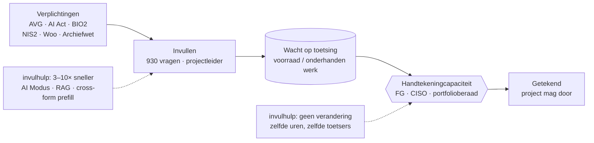
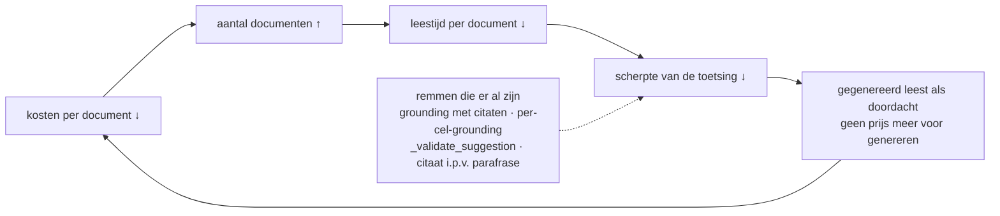
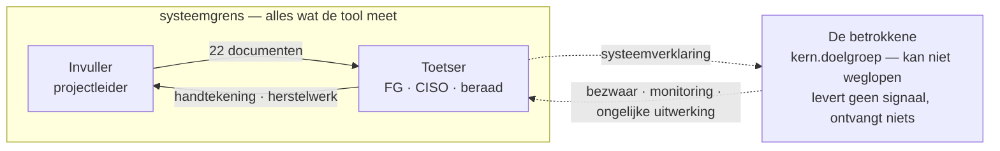

# Systeemanalyse: de invulhulp in het verantwoordingsstelsel

> **Status:** analyse — geen commitment. Dit document beschrijft geen ontwerp en vraagt geen
> bouwbesluit. Het zet de invulhulp neer als ingreep in het stelsel waarin hij landt, en
> benoemt welke terugkoppelingen die ingreep in gang zet. Het bouwt voort op
> [`normenkader-dekkingsanalyse.md`](normenkader-dekkingsanalyse.md),
> [`systeemprofiel-feitenbasis.md`](systeemprofiel-feitenbasis.md),
> [`sporen-en-roadmap.md`](sporen-en-roadmap.md),
> [`interviewmodus-socratisch-gesprek.md`](interviewmodus-socratisch-gesprek.md) en
> [`rollen-en-rechten-advies.md`](rollen-en-rechten-advies.md) — die documenten leveren de
> feiten, dit document de systeemlaag eromheen.
>
> Een vormgegeven versie met dezelfde inhoud (Engelstalig, met getekende diagrammen) staat op
> <https://claude.ai/artifact/EMMK8Fg88yqrC5vN7GZ5pk>. Die link is privé; delen gaat via het
> Share-menu van die pagina.
>
> De luscodes (R1–R3 versterkend, B1–B4 balancerend) zijn van deze analyse, niet van de repo.

## 1. In welk systeem landt dit eigenlijk?

Het technische systeem is Vue, FastAPI en een LLM. Het **sociale** systeem waarin de invulhulp
landt is het verantwoordingsstelsel: de machinerie waarmee de overheid aan zichzelf aantoont
dat wat zij bouwt rechtmatig, veilig en verdedigbaar is.

Dat stelsel heeft een herkenbare vorm:

| Element | Wat het hier is |
|---|---|
| **Voorraad** | De stapel IV-verzoeken die nog verantwoord moet worden |
| **Instroom** | Nieuwe verplichtingen — AVG art. 35, AI-verordening, BIO2, NIS2, Woo, Archiefwet, Tijdelijk besluit digitale toegankelijkheid |
| **Uitstroom** | Getekende assessments |
| **Beperking op de uitstroom** | Niet de invullers, maar de lezers en tekenaars: FG, CISO, architect, portfolioberaad, AcICT |
| **Vertraging** | Maanden tussen "we beginnen aan een DPIA" en "iemand met bevoegdheid accepteert het restrisico" |

De instroom wordt extern gezet (Brussel, Den Haag) en groeit al een decennium superlineair. De
verwerkingscapaciteit groeit met de snelheid waarmee een departement mensen aanneemt. **Die
scheefheid is de motor onder alles wat volgt.**

De symptomen zijn precies waar deze repo tegen gebouwd is: knip-en-plak tussen DPIA en AIIA
(44 van de toen 87 mappings liepen tussen die twee), formulieren die de avond voor een
poortje worden ingevuld, en tegenstrijdigheden die maanden te laat boven water komen.

*De doorstroom wordt bepaald bij het ventiel, niet bij de tank ervoor. Sneller produceren
terwijl het ventiel gelijk blijft verhoogt het onderhanden werk, niet het tempo waarin
projecten door mogen.*

## 2. Waar in het stelsel grijpt de tool aan?

Op de hefboomladder van Donella Meadows raakt de invulhulp vier niveaus tegelijk — en het
niveau dat het meest wordt genoemd is het zwakste.

| Niveau | Wat in de tool | Hefboom |
|---|---|---|
| Stroomsnelheden | AI Modus, RAG-extractie, "verbeter tekst" | zwak — maakt invullen sneller |
| Informatiestromen | 351 cross-form-mappings, URN's, `source`-lineage, het dossier als één gedeeld object | **sterk** — maakt het landschap leesbaar |
| Regels | toepasselijkheid, decision gates, de blokkade bij onaanvaardbaar risico, restrisico als sluitsteen | **sterk** — bepaalt wat door mag |
| Paradigma | feitenbasis in plaats van formulieren-als-datamodel; de systeemverklaring voor de burger | **sterkst** — nog niet gebouwd |

**De AI is het systemisch minst interessante deel van deze tool.** Het interessantste is dat
22 instrumenten van vijf verschillende eigenaren voor het eerst bestaan als één samenhangende
graaf met vastgelegde herkomst, in één object met één toegangsmodel. Dat is een ingreep op de
informatiestroom, en dáár zit goedkope, duurzame hefboom.

## 3. Voorspelde effecten

### 3.1 De beperking verplaatst zich — B1

De voorspelling met de hoogste zekerheid in dit document. De tool verlaagt de kosten van het
*produceren* van verantwoordingsdocumenten met naar schatting een factor 3 tot 10. De kosten
van het *lezen en tekenen* verlaagt hij met ongeveer nul.

Een niet-knelpunt versnellen verhoogt de doorstroom niet; het verhoogt het onderhanden werk
bij het knelpunt. Binnen twee kwartalen na echte adoptie is te verwachten:

- de wachtrijen bij FG en CISO worden langer, niet korter;
- de leestijd per document daalt (meer binnen, gelijk aantal uren), precies terwijl het
  volume per project stijgt;
- de waardering splitst per rol: projectleiders zijn enthousiast, toetsers stil geïrriteerd.

De remedie staat al half uitgewerkt in [`rollen-en-rechten-advies.md`](rollen-en-rechten-advies.md):
de adviesrol, de besluitrol, de publicatierol. Dat is geen rechtenhygiëne maar **de
doorstroomingreep**. Vandaag kan de invuller zijn eigen restrisico accepteren — een
regelkring met de terugkoppeldraad doorgeknipt.

### 3.2 Vlotheid ontkoppelt van begrip — R2

De waarde van een DPIA zat nooit in het document; die zat erin dat het schrijven ervan iemand
dwong na te denken. Het document was een *proxy* voor dat denken, en die proxy werkte mede
omdát hij duur was: inspanning was een kostbaar signaal.

Een LLM die compliance-proza schrijft uit geüploade documenten haalt de kosten uit het signaal
en laat het signaal staan. Dat is de leerboekvoorwaarde voor de wet van Goodhart.

Elke stap is op zichzelf redelijk; het is de kring die maakt dat de *gemeten* compliance stijgt
terwijl de feitelijke veiligheid van de systemen blijft waar hij was. Alle remmen werken op
dezelfde manier: ze houden een bewering falsifieerbaar — herleidbaar tot een bron, of tot iets
dat een met naam genoemd mens werkelijk heeft gezegd.

§9.2 van [`interviewmodus-socratisch-gesprek.md`](interviewmodus-socratisch-gesprek.md) bevat
de scherpste formulering: *sla het citaat op, niet de parafrase; publiceer wat de mens zei.*
Die ene regel is het verschil tussen een tool die mensen helpt op te schrijven wat ze weten en
een tool die helpt op te schrijven wat ze niet weten.

**Versterk hem.** Wat het model schreef moet visueel onderscheidbaar blijven van wat een mens
schreef, tot in de Word-export en tot in het oog van de toetser. Zodra die twee in het artefact
niet meer te onderscheiden zijn, is de proxy dood en leest de toetser theater.

### 3.3 Jevons: goedkoper toetsen betekent méér toetsen, niet minder werk — R1

Als compliance goedkoop wordt, spaart de organisatie de winst niet op. Ze breidt het regime
uit: naar kleinere projecten, naar wat eerder werd doorgelaten, naar verplichtingen die eerder
onbetaalbaar leken. Deze repo doet het al: 22 formulieren, 930 vragen, vijf voorstellen extra,
en alleen in het cluster openbaarheid/Woo nog eens ± 50 ongedekte controls
([`normenkader-dekkingsanalyse.md`](normenkader-dekkingsanalyse.md) §4A).

Netto-effect op de werklast van de gemiddelde projectleider: waarschijnlijk vlak. Netto-effect
op de dekking: fors omhoog. Dat is een echte winst — maar het *is* de winst. Wie dit verkoopt
als "minder papierwerk" wordt binnen een jaar tegengesproken door zijn eigen gebruikers.

### 3.4 De last verschuiven naar de hulpconstructie — B3

Een klassiek archetype (*shifting the burden to the intervenor*). Het eigen begrip van de
projectleider van privacy-, beveiligings- en grondrechtenrisico is de *fundamentele* oplossing;
de tool is de *symptomatische*. Elke symptomatische verlichting verlaagt de druk om de
fundamentele capaciteit op te bouwen, en de afhankelijkheid versterkt zichzelf.

Concreet: weet een projectleider na twee jaar AI Modus nog waaróm zijn systeem een DPIA nodig
heeft, of alleen dat de tool er een heeft opgeleverd? Dat antwoord bepaalt of deze organisatie
competenter wordt of alleen volgzamer. De interviewmodus is het enige ontwerp in de repo dat de
andere kant op duwt — een socratische interviewer bouwt het begrip op dat hij ophaalt. Niet
toevallig is het ook het ontwerp met het scherpst beschreven risico: een sturende vraag kan een
DPIA laten verdwijnen (§9.1 aldaar).

### 3.5 Zwaartekracht richting standaard — R3

Door `urn:nl:minfin:tr:*` te munten naast `urn:nl:aivt:tr:*`, de MinBZK-beslishulp te vendoren,
DPIA en IAMA uit upstream-YAML te genereren en onder EUPL-1.2 te publiceren, is de tool
feitelijk een interoperabiliteitslaag tussen departementen geworden — vanaf de rand gebouwd,
niet vanuit het centrum. Dat werkt meestal: de standaard die wint is die met een draaiende
implementatie. Twee tweede-orde-effecten volgen.

- **Vastlegging van één ontologie.** `Dossier` = één project, één exemplaar van elk formulier
  is aan beide kanten al zichtbaar onjuist: te grofmazig voor organisatiebrede instrumenten, te
  fijnmazig voor datasets en verwerkingen ([`sporen-en-roadmap.md`](sporen-en-roadmap.md) §3).
  De repo weet dit. De systeemdynamiek zegt dat het venster om het te herstellen sneller sluit
  dan het voelt.
- **Harmonisatie is een voorraad die vervalt.** Model DPIA v3.0, het Algoritmeregister-schema
  en de modelverklaring toegankelijkheid ontwikkelen zich onafhankelijk door. Zonder een
  *staande stroom* onderhoud wordt een tool die lineage claimt op enig moment met overtuiging
  onjuist — op een manier die een Word-sjabloon nooit kon zijn, juist omdat mensen de tool meer
  vertrouwen.

### 3.6 De ex-ante-scheefheid wordt eerst groter — B2

Elk instrument in de tool zit in Plan. Het spoor `beheer` is leeg — bewust en eerlijk zichtbaar,
maar leeg. Ondertussen zijn juist de verplichtingen die tijdens het gebruik bijten de ongedekte:
AI Act art. 26, 72 en 73; AVG art. 35 lid 11 en art. 33.

De tool verlaagt dus de kosten van de fase die al overbediend is en laat de onderbediende fase
onaangeroerd. Op korte termijn **vergroot** hij de scheefheid. Ethiek die je één keer toetst op
het moment van de minste informatie en daarna nooit herziet is, in de woorden van deze repo,
per constructie ritueel.

> De grootste ongebouwde hefboom is de **werkings-as**. Geen nieuw formulier — een tweede
> waarneming van dezelfde feiten, later. Dat is wat een document verandert in een regelkring,
> en een systeem zonder regelkring kan niet leren.

### 3.7 De systeemgrens: wie zit er in de lus? — B4

De tool levert 22 documenten voor 22 functionarissen en nul voor degene op wie het systeem wordt
toegepast. Het normenkader met zijn 481 controls doet dat evenmin. De lus die geoptimaliseerd
wordt loopt ambtenaar → toetser → ambtenaar, en die lus is gesloten: de burger uit
`kern.doelgroep` — die er volgens de eigen vraag van de tool niet voor kan kiezen — levert geen
signaal en ontvangt geen artefact.

*Beide stippellijnen zijn gestippeld omdat geen van beide bestaat.*

Een gesloten lus optimaliseert voor zijn eigen leden. Dat is geen cynisme maar structuur: het
stelsel wordt beter in het tevredenstellen van toetsers en niet beter in het beschermen van de
bestuurden, omdat niets erin dat laatste meet. De **systeemverklaring** uit
[`systeemprofiel-feitenbasis.md`](systeemprofiel-feitenbasis.md) §4.3 wordt daar beschreven als
een output. Het is meer dan dat: het is de enige plek waar een corrigerend signaal het stelsel
binnen zou kunnen komen.

## 4. Eindoordeel

**Richting van het effect: positief, met een goed begrepen manier om mis te gaan.**

Het waarschijnlijke beeld over twee à drie jaar, zonder bewust tegenontwerp: duidelijk betere
dekking en herleidbaarheid — echt, duurzaam, en een reële winst in uitvoeringskracht. Ongeveer
gelijke werklast. En een kwaliteit van toetsing per document die daalt terwijl de schijnbare
volledigheid stijgt.

> De overheid weet dan preciezer wát ze heeft gebouwd, en begrijpt het iets minder goed.

Vier ontwerpkeuzes bepalen of die laatste zin uitkomt. Op volgorde van hefboom:

| # | Keuze | Waarom |
|---|---|---|
| 1 | **Geef de toetsrollen echte bevoegdheid** — advies, besluit, publicatie | Het knelpunt zit in de uitstroom, niet in de instroom. En niemand accepteert zijn eigen restrisico. |
| 2 | **Bouw de werkings-as** | Eén tweede meetmoment maakt van papierwerk een regelkring: het verschil tussen Plan en PDCA. |
| 3 | **Laat modeltekst nooit doorgaan voor mensentekst** | Citaten in plaats van parafrases, citaten bij elke bewering, AI-herkomst zichtbaar tot in de export. |
| 4 | **Lever de systeemverklaring** | Het enige artefact hier dat de lus opent naar de mensen over wie die lus zogenaamd gaat. |

Deze vier zijn uitgewerkt tot zeven concrete ingrepen, met de vier voorwaarden waaronder een
mens tot stempelmachine wordt en welke ingreep welke voorwaarde breekt, in
[`ontwerprichting-betekenisvolle-tussenkomst.md`](ontwerprichting-betekenisvolle-tussenkomst.md).

Tot slot, en het is het vermelden waard omdat de repo het zelf al goed ziet: **formulier-eerst
was de juiste binnenkomst.** Je ontmoet elke eigenaar in het artefact waar hij verantwoordelijk
voor is, en verdient daarmee het recht op de feiten eronder
([`systeemprofiel-feitenbasis.md`](systeemprofiel-feitenbasis.md) §5). Het systeemrisico is niet
dat die strategie fout was. Het is dat het bruggenhoofd wordt aangezien voor de bestemming — en
de organisatie eindigt met een zeer snelle, zeer herleidbare, zeer goed ontworpen machine die
verantwoording produceert over systemen die niemand beter is gaan begrijpen.

## 5. Verantwoording

Geschreven tegen de repo zoals die op 23 september 2026 stond. Gelezen: `README.md`,
`ARCHITECTURE.md`, `docs/sporen-en-roadmap.md`, `docs/normenkader-dekkingsanalyse.md`,
`docs/systeemprofiel-feitenbasis.md`, `docs/interviewmodus-socratisch-gesprek.md`,
`docs/toepasselijkheid-van-formulieren.md`, `docs/rollen-en-rechten-advies.md`,
`public/forms/index.json`.

Let op één inconsistentie in de brondocumenten: het aantal cross-form-mappings staat er als 87,
152 en 351 — die groei is het gevolg van de uitdijende formulierenset tussen die documenten in,
en is zelf een illustratie van §2 (de handgeschreven, kwadratische versie van een feitenbasis).
